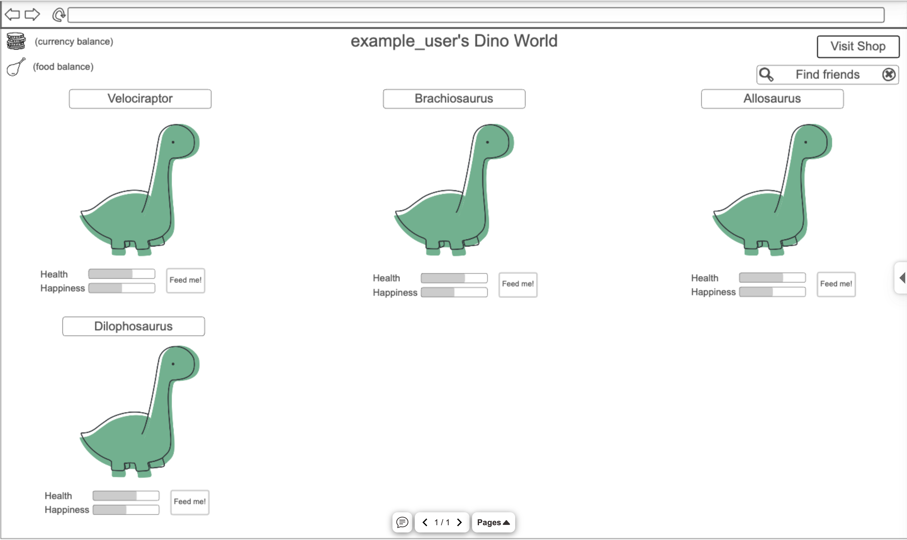

# Your startup name here

[My Notes](notes.md)

A brief description of the application here. Lorem ipsum dolor sit amet, consectetur adipiscing elit, sed do eiusmod tempor incididunt ut labore et dolore magna aliqua. Ut enim ad minim veniam, quis nostrud exercitation ullamco laboris nisi ut aliquip ex ea commodo consequat. Duis aute irure dolor in reprehenderit in voluptate velit esse cillum dolore eu fugiat nulla pariatur. Excepteur sint occaecat cupidatat non proident, sunt in culpa qui officia deserunt mollit anim id est laborum.

## 🚀 Specification Deliverable

For this deliverable I did the following. I checked the box `[x]` and added a description for things I completed.

- [x] Proper use of Markdown
I read through the Markdown page linked in the instructions and now I should know enough to keep my files organized.
- [x] A concise and compelling elevator pitch
I wrote the elevator pitch below as a very quick description of what I hope my webapp will be able to do.
- [x] Description of key features
I described the key things that my webapp should be able to do by the end of the semester, although I may have been slightly ambitious.
- [x] Description of how you will use each technology
I categorized all the functions of the webapp into what technology they will need to use.
- [x] One or more rough sketches of your application. Images must be embedded in this file using Markdown image references.
I used NinjaMock to create a rough sketch of what the main page of the webapp should look like after the user is logged in.

### Elevator pitch

It is a sad truth that it is currently quite impossible to obtain a pet dinosaur. Don't fret! Introducing: Dino Pals, a way to befriend and take care of your very own ancient reptiles. Whether you want to raise your favorite dinosaur all on your own or show off your adorably terrifying collection to your friends, Dino Pals is the webapp for you. Come hatch your first egg today!

### Design

### Key features

- A shop which will include dinosaur eggs, food, and various aesthetic options; the currency will be dinosaur scales
- Eggs will develop more cracks over time before hatching, then the baby dinos will go through a few stages of growth before reaching adulthood
- Adult dinos will regularly shed scales if they are kept happy and healthy
- Users can take care of their dinos by feeding them and playing with them
- Users can connect with friends and view their friends' dinosaurs (maybe they can feed and play with their friends' dinosaurs too)

### Technologies

I am going to use the required technologies in the following ways.

- **HTML** - 3 HTML pages: login, dino enclosure, and shop. Hyperlinks to view friends' enclosures.
- **CSS** - Webapp should be designed to look good on screen sizes ranging from a smartphone to a desktop computer. Color palette should be designed so that all available colors in the shop will look good together.
- **React** - Used for login, displaying dinosaurs and options in the shop, provides interactivity such as feeding dinosaurs and making purchases.
- **Service** - Retrieving what dinos the user has purchased and their info including age, happiness, and hunger, submitting new purchases of dinosaurs, food, and aesthetic options, and retrieving friends list and hyperlinks to view their enclosures. Access Colormind API for help with color palette generation.
- **DB/Login** - Stores users, purchases, currency balance, and friends list. Login should be secure and you should not be able to use the webapp without logging in.
- **WebSocket** - Send invitations to friends and accept invitations from others. View friends' enclosures.

## 🚀 AWS deliverable

For this deliverable I did the following. I checked the box `[x]` and added a description for things I completed.

- [x] **Server deployed and accessible with custom domain name** - https://dinosaurpals.org

## 🚀 HTML deliverable

For this deliverable I did the following. I checked the box `[x]` and added a description for things I completed.

- [x] **HTML pages** - I created 3 HTML pages - one for home/login, one for the user's dinosaur enclosure, and one for the shop.
- [x] **Proper HTML element usage** - I used proper HTML structure for each page, including headers, footers, and navigation menus.
- [x] **Links** - I've added links between the pages I created.
- [x] **Text** - I added text to the pages as appropriate, including titles, labels, and a welcome message on the homepage.
- [x] **3rd party API placeholder** - As my API will be used to alter colors, it was difficult to integrate here, but the color of items in the shop will change, as will the background color for the main body, navigation bar, and footer.
- [x] **Images** - Several images were added to be used as icons or visuals for purchaseable items in the shop, as well as dinosaurs for the user's enclosure. Further images will be added with a greater variety of dinosaurs in the future.
- [x] **Login placeholder** - I added a form with two input fields for the user to either create an account or login, as well as a logout button that takes the user back to that form.
- [x] **DB data placeholder** - Sample numbers are in place for the happiness and health levels of the dinosaurs, as well as the currency and food balances of the user. 
- [x] **WebSocket placeholder** - I've added a search bar for users to connect with their friends through their usernames.

## 🚀 CSS deliverable

For this deliverable I did the following. I checked the box `[x]` and added a description for things I completed.

- [x] **Header, footer, and main content body** - I styled these elements in all three pages.
- [x] **Navigation elements** - I added a different font to the menu bar and removed the default link styling.
- [x] **Responsive to window resizing** - I set the grid layout to change on smaller screen sizes for the shop and enclosure.
- [x] **Application elements** - I styled these elements in all three pages.
- [x] **Application text content** - I styled the various text elements as necessary in all three pages.
- [x] **Application images** - I scaled and styled the images in all three pages.

## 🚀 React part 1: Routing deliverable

For this deliverable I did the following. I checked the box `[x]` and added a description for things I completed.

- [x] **Bundled using Vite** - I did complete this part of the deliverable.
- [x] **Components** - I did complete this part of the deliverable.
- [x] **Router** - Routing between the 3 'pages' of my application, which is now loaded as a SPA.

## 🚀 React part 2: Reactivity

For this deliverable I did the following. I checked the box `[x]` and added a description for things I completed.

- [x] **All functionality implemented or mocked out** - I added functionality so the user can buy things in the shop, login properly, and the values in the enclosure such as balances and number of dinos update as necessary.
- [x] **Hooks** - I used useState and useEffect in both the shop and enclosure components of my webapp.

## 🚀 Service deliverable

For this deliverable I did the following. I checked the box `[x]` and added a description for things I completed.

- [ ] **Node.js/Express HTTP service** - I did not complete this part of the deliverable.
- [ ] **Static middleware for frontend** - I did not complete this part of the deliverable.
- [ ] **Calls to third party endpoints** - I did not complete this part of the deliverable.
- [ ] **Backend service endpoints** - I did not complete this part of the deliverable.
- [ ] **Frontend calls service endpoints** - I did not complete this part of the deliverable.

## 🚀 DB/Login deliverable

For this deliverable I did the following. I checked the box `[x]` and added a description for things I completed.

- [ ] **User registration** - I did not complete this part of the deliverable.
- [ ] **User login and logout** - I did not complete this part of the deliverable.
- [ ] **Stores data in MongoDB** - I did not complete this part of the deliverable.
- [ ] **Stores credentials in MongoDB** - I did not complete this part of the deliverable.
- [ ] **Restricts functionality based on authentication** - I did not complete this part of the deliverable.

## 🚀 WebSocket deliverable

For this deliverable I did the following. I checked the box `[x]` and added a description for things I completed.

- [ ] **Backend listens for WebSocket connection** - I did not complete this part of the deliverable.
- [ ] **Frontend makes WebSocket connection** - I did not complete this part of the deliverable.
- [ ] **Data sent over WebSocket connection** - I did not complete this part of the deliverable.
- [ ] **WebSocket data displayed** - I did not complete this part of the deliverable.
- [ ] **Application is fully functional** - I did not complete this part of the deliverable.
